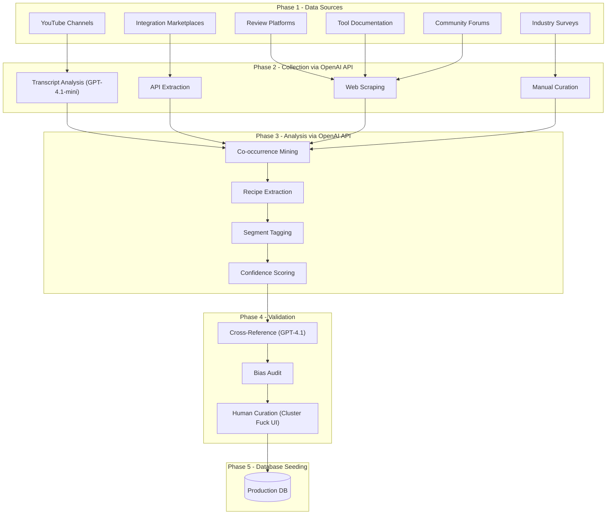

# Research-Driven Intelligence Plan for Tool Clusters & Automation Recipes

> **AI Provider**: OpenAI API (`OPENAI_API_KEY`)
> **Admin Interface**: "Cluster Fuck" — dedicated admin dashboard page for curation, approval, and management
> **Target**: 100+ validated ToolCluster records, 200+ validated AutomationRecipe records, seeded and production-ready

---

## Table of Contents

1. [Overview & Deliverables](#1-overview--deliverables)
2. [Architecture](#2-architecture)
3. [User Segments & Coverage Targets](#3-user-segments--coverage-targets)
4. [Phase 1: Source Identification](#4-phase-1-source-identification)
5. [Phase 2: Data Collection](#5-phase-2-data-collection)
6. [Phase 3: Analysis & Pattern Extraction](#6-phase-3-analysis--pattern-extraction)
7. [Phase 4: Validation](#7-phase-4-validation)
8. [Phase 5: Database Seeding](#8-phase-5-database-seeding)
9. [Phase 6: Ongoing Intelligence Loop](#9-phase-6-ongoing-intelligence-loop)
10. [Token Estimation & Cost Breakdown](#10-token-estimation--cost-breakdown)
11. ["Cluster Fuck" Admin Page Specification](#11-cluster-fuck-admin-page-specification)
12. [Timeline & Quality Gates](#12-timeline--quality-gates)

---

## 1. Overview & Deliverables

### Goal

Build a production-ready knowledge base of validated tool clusters and automation recipes, grounded in real-world usage data (as of February 2026), that makes the platform smart from day one and improves with user feedback over time.

### Deliverables

| # | Deliverable | Target |
|---|-------------|--------|
| 1 | Validated ToolCluster records | >= 100, confidence >= 60 |
| 2 | Validated AutomationRecipe records | >= 200, confidence >= 60 |
| 3 | Segment coverage matrix | All Tier 1 segments >= 15 data points |
| 4 | Bias audit report | All 12 checklist items passing |
| 5 | Seeded production database | Ready for engine queries |
| 6 | "Cluster Fuck" admin dashboard page | Curation, approval, bias audit, stats |
| 7 | Ongoing refresh pipeline | Monthly cadence + user feedback loop |

### What This Enables

- The recommendation engine can query real tool clusters (not hardcoded lists) when building scenarios
- Automation recipes surface in workflow phases with concrete trigger/action details
- Scoring weights and tool counts become data-driven, informed by actual usage patterns
- The platform ships "smart from day one" and gets smarter with every user interaction

---

## 2. Architecture



### Data Flow Summary

1. **Collect** raw data from 6 source types (manual + automated)
2. **Extract** structured data points using OpenAI API (GPT-4.1-mini for bulk, GPT-4.1 for reasoning)
3. **Analyze** patterns: co-occurrence mining, recipe extraction, segment tagging, confidence scoring
4. **Validate** via cross-referencing, bias audit checklist, and human curation in the Cluster Fuck admin page
5. **Seed** validated records into the production database as ToolCluster and AutomationRecipe rows
6. **Maintain** with monthly refreshes and user feedback integration

---

## 3. User Segments & Coverage Targets

Every data point must be tagged with the segment it represents. Research must achieve minimum coverage across all cells.

### Segment Dimensions (from the assessment form)

| Dimension | Values |
|-----------|--------|
| Stage | Bootstrapping, Pre-Seed, Early-Seed, Growth, Established |
| Team Size | Solo (1), Small (2-5), Medium (6-20), Large (21-100), Enterprise (100+) |
| Tech Savviness | Newbie, Decent, Ninja |
| Role/Function | Engineering, Product, Design, Marketing, Operations, Mixed |

### Coverage Targets

| Tier | Segment Combinations | Minimum Data Points |
|------|---------------------|-------------------|
| Tier 1 | Solo/Small + Bootstrapping/Pre-Seed | >= 15 each |
| Tier 2 | Medium + Growth/Early-Seed | >= 10 each |
| Tier 3 | Large/Enterprise + Established | >= 5 each |
| Any segment below 5 data points | — | Flagged as "low confidence" |

### Category Parity Targets

| Metric | Threshold |
|--------|-----------|
| Cluster appearances per ToolCategory | >= 15 per category (all 11 categories) |
| Recipe appearances per ToolCategory | >= 20 per category |
| Categories below threshold | Get dedicated research passes |

---

## 4. Phase 1: Source Identification

### Source 1: YouTube Channels

**Purpose:** Real workflows demonstrated on screen, tool abandonment stories, audience validation via comments.

**Discovery Criteria:**

| Criterion | Threshold |
|-----------|-----------|
| Subscribers | >= 30,000 |
| Average views per video (last 20) | >= 50,000 |
| Comments per video | >= 200 (high engagement) |
| Active | Uploaded within last 3 months |
| Channel age | >= 1 year |

**7 Content Categories (minimum 15 channels per category):**

| Category | Example Search Queries | Primary Segment Coverage |
|----------|----------------------|------------------------|
| Productivity & tool stacks | "my productivity stack 2025", "best tools for startups 2026" | All segments broadly |
| No-code & automation | "automation workflow tutorial", "zapier vs make", "n8n tutorial" | Newbie/Decent, non-technical teams |
| Developer workflows | "my dev workflow", "cursor workflow", "AI coding tools" | Decent/Ninja, engineering teams |
| Design workflows | "my design workflow", "figma process", "design handoff" | Design teams (often missed) |
| Agency & freelancer | "agency tools stack", "freelancer workflow", "client management" | Solo/Small, Bootstrapping |
| Product management & ops | "product management tools", "sprint planning", "startup operations" | PM/Ops roles, Medium teams |
| Marketing & growth | "marketing tech stack", "growth tools startups", "content workflow" | Marketing teams, ANALYTICS/GROWTH categories |

**Extraction Per Video:**

- Tool mentions (with context: primary use, sentiment, sponsorship flag)
- Automation recipes shown on screen (trigger, action, connector)
- Tools abandoned and replacement reasoning (strongest signal)
- Creator's segment profile (team size, stage, role inferred from context)
- Top 50 comments analyzed for: alternatives suggested, full stacks shared, contradictions to creator

**Bias Controls:**

| Control | Implementation |
|---------|---------------|
| Sponsorship detection | Scan description for #ad, #sponsored, affiliate links, discount codes |
| Sponsorship discount | Sponsored tool mentions weighted at 30% (70% discount) |
| Abandonment signal boost | "Tool abandoned" and "switched from" signals weighted at 1.5x |
| Comment validation boost | Comment-sourced data weighted at 1.2x vs creator claims |

**Target: 150+ qualifying channels, 500+ qualifying videos**

---

### Source 2: Integration Marketplaces

**Purpose:** What automations people actually build — behavioral data, not opinions.

| Platform | What to Extract | Access Method |
|----------|----------------|---------------|
| Zapier Popular Zaps | Trigger/action pairs, user counts, categories | Public directory scraping |
| Make (Integromat) Templates | Multi-step workflows, tool chains, use cases | Public template gallery |
| n8n Community Workflows | Open-source automation patterns, setup complexity | GitHub + community site |
| GitHub Actions Marketplace | CI/CD tool chains, star counts, usage stats | GitHub API |
| Slack App Directory | Slack-centric integrations, install counts | Public directory |
| Pipedream Public Workflows | Event-driven automations, code examples | Public registry |

**Extraction Per Recipe:**

- Trigger tool + event type
- Action tool + result type
- Connector type (native, Zapier, Make, webhook, API, MCP)
- Adoption signal (user count, installs, stars)
- Setup complexity (inferred from step count and config requirements)

**Bias Controls:**

| Control | Implementation |
|---------|---------------|
| Platform normalization | Zapier over-represents Zapier-compatible tools; normalize against native integration data |
| Developer tool balance | GitHub Actions over-represents dev tools; balance with Zapier/Make for non-dev categories |
| Adoption cap | Weight recipes by adoption count but cap influence at 1,000 users (prevents mega-popular recipes from dominating) |
| Connector diversity | Include recipes from ALL connector types, not just Zapier |

**Target: 2,000+ raw automation patterns, 500+ unique trigger/action pairs**

---

### Source 3: Review Platforms

**Purpose:** Tool satisfaction, co-usage patterns ("customers also use"), segment-specific ratings.

| Platform | What to Extract | Segment Strength |
|----------|----------------|-----------------|
| G2 | "Best for" data, company size filters, category leaders, "customers also use" | Enterprise + Established |
| Capterra | User reviews by company size, comparison pages, shortlists | Small/Medium businesses |
| TrustRadius | Detailed reviews, feature-level ratings, deployment info | Medium/Large teams |
| ProductHunt | Launch context, upvote demographics, maker comments | Bootstrapping/Pre-Seed, early adopters |

**Extraction Per Tool:**

- "Customers also use" / "frequently bought together" data (direct cluster signal)
- Satisfaction ratings by company size and industry
- Feature-level ratings (maps to phase capabilities)
- "Switched from" data (replacement patterns)
- Review text mining for integration mentions and workflow descriptions

**Bias Controls:**

| Control | Implementation |
|---------|---------------|
| Enterprise skew correction | G2 skews enterprise; weight small-company reviews higher to balance |
| Early adopter tagging | ProductHunt data tagged as "Ninja savviness likely" |
| Paid placement detection | Cross-reference rankings across platforms to detect pay-for-play |
| Negative signal capture | Actively extract negative reviews and "switched from" data |

**Target: Coverage for all 250 tools in the database, "also used with" data for top 100**

---

### Source 4: Tool Official Documentation

**Purpose:** Ground truth on what integrations actually exist and how they work.

**What to Scrape (for top 50 tools):**

- Integration/connections pages (list of official integrations)
- API documentation (what's programmatically possible)
- Automation template libraries (tool-provided recipes)
- Changelog entries mentioning new integrations (last 12 months)
- MCP server directories (for AI tool integrations)

**Extraction Per Tool:**

- List of official integrations with quality level (native, API, webhook)
- Setup documentation (maps to SetupDifficulty enum)
- MCP server availability
- Integration deprecation notices (negative signal)

**Bias Controls:**

| Control | Implementation |
|---------|---------------|
| Marketing vs reality | Tools with better marketing appear more connected; verify claimed integrations against marketplace data |
| "Coming soon" exclusion | Only count shipped integrations |
| Native priority | Weight native integrations higher than claimed API compatibility |
| Bidirectional verification | If Tool A claims integration with Tool B, verify Tool B also claims it |

**Target: Verified integration matrix for top 50 tools (2,500 potential pairs)**

---

### Source 5: Community Forums

**Purpose:** Unfiltered user experiences, niche tool combinations, segment-specific advice.

| Platform | Search Strategy | Segment Strength |
|----------|----------------|-----------------|
| Reddit (r/SaaS, r/startups, r/productivity, r/webdev, r/nocode, r/EntrepreneurRideAlong) | "what tools", "my stack", "switched from", "workflow" | Broad, varies by subreddit |
| Hacker News | "Ask HN: What tools", "Show HN" tool launches, "what do you use for" | Ninja developers |
| IndieHackers | "What tools do you use", product updates, milestone posts | Solo/Small, Bootstrapping |
| Dev.to / Hashnode | "My development setup", "tools I use" blog posts | Developers |
| LinkedIn | "Our team uses", tool recommendation threads | Medium/Large, professional context |

**Extraction Per Thread:**

- Tool stacks shared (complete combinations)
- Reasons for tool choices (maps to scoring factors)
- Pain points with current stacks (maps to replacement opportunities)
- Automation tips shared in comments
- Team context (size, stage, role) when mentioned

**Bias Controls:**

| Control | Implementation |
|---------|---------------|
| Ninja skew awareness | Reddit/HN heavily skew Ninja developer; tag accordingly, don't generalize to Newbie |
| Solo/bootstrapping scoping | IndieHackers skews solo/bootstrapping; valuable for that segment, don't extrapolate to enterprise |
| Quality threshold | Only extract from threads with 10+ upvotes/comments |
| Experience over opinion | Weight "I personally use" over "I recommend" |

**Target: 300+ stack descriptions with segment context**

---

### Source 6: Industry Surveys & Reports

**Purpose:** Statistically representative data across segments.

| Source | What to Extract | Segment Strength |
|--------|----------------|-----------------|
| Stack Overflow Developer Survey 2025 | Developer tools, team sizes, co-usage | Developers |
| Statista SaaS usage reports | Market-level adoption rates | Broad |
| Bessemer / a16z State of SaaS | Startup tool trends | Startups |
| Okta Businesses at Work | Enterprise app usage and co-usage | Enterprise |
| Productiv SaaS Management Report | Actual usage data (not just licenses) | Medium/Large |

**Extraction:**

- Tool adoption rates by company size
- Co-usage correlations (tools used together)
- Year-over-year trends (growing vs declining tools)
- Category-level spending data

**Bias Controls:**

| Control | Implementation |
|---------|---------------|
| Survey scope | Stack Overflow only for DEVELOPMENT category conclusions |
| Enterprise scoping | Okta only for Large/Enterprise segment |
| Behavioral cross-check | Cross-reference survey data with behavioral data (marketplace, GitHub) |

**Target: Segment-normalized adoption rates for top 100 tools**

---

## 5. Phase 2: Data Collection

### OpenAI API Configuration

**Required Environment Variable:**

```bash
OPENAI_API_KEY=sk-your-openai-api-key-here
```

**NPM Dependency:**

```bash
npm install openai
```

### Model Selection Strategy

| Task Type | Model | Rationale |
|-----------|-------|-----------|
| High-volume extraction (transcripts, comments, threads, reviews, docs) | `gpt-4.1-mini` | Cost-effective structured extraction; $0.40/1M input, $1.60/1M output |
| Ultra-budget extraction (if budget is tight) | `gpt-4.1-nano` | Cheapest option; $0.10/1M input, $0.40/1M output |
| Reasoning-heavy (cluster analysis, recipe normalization, validation) | `gpt-4.1` | Higher quality for complex reasoning; $2.00/1M input, $8.00/1M output |
| All non-urgent tasks | Batch API | 50% cost savings on all models; 24-hour turnaround |

### OpenAI Client Setup

```typescript
// lib/research/openaiClient.ts

import OpenAI from 'openai';

let client: OpenAI | null = null;

export function getOpenAIClient(): OpenAI {
  if (!client) {
    const apiKey = process.env.OPENAI_API_KEY;
    if (!apiKey) {
      throw new Error('OPENAI_API_KEY environment variable is required for research tasks');
    }
    client = new OpenAI({ apiKey });
  }
  return client;
}

// Model constants — single source of truth
export const RESEARCH_MODELS = {
  EXTRACTION: 'gpt-4.1-mini',     // High-volume structured extraction
  EXTRACTION_BUDGET: 'gpt-4.1-nano', // Ultra-budget extraction
  REASONING: 'gpt-4.1',           // Cluster analysis, validation, creative naming
} as const;
```

### Extraction Task: YouTube Transcript Analysis

```typescript
// lib/research/extractors/youtubeExtractor.ts

import { getOpenAIClient, RESEARCH_MODELS } from '../openaiClient';

interface ToolMention {
  toolName: string;
  context: string;           // How it was mentioned
  sentiment: 'positive' | 'negative' | 'neutral';
  isPrimary: boolean;        // Primary recommendation vs passing mention
  isSponsored: boolean;      // Detected as sponsored
}

interface AutomationPattern {
  triggerTool: string;
  triggerEvent: string;
  actionTool: string;
  actionType: string;
  connectorType: string;
  description: string;
}

interface TranscriptExtraction {
  tools: ToolMention[];
  automations: AutomationPattern[];
  abandonedTools: { tool: string; reason: string; replacedWith: string | null }[];
  creatorSegment: {
    teamSize: string;
    stage: string;
    savviness: string;
    role: string;
  };
  fullStack: string[];       // Complete tool stack if described
}

export async function extractFromTranscript(
  transcript: string,
  videoMetadata: { title: string; channelName: string; description: string }
): Promise<TranscriptExtraction> {
  const openai = getOpenAIClient();

  const response = await openai.chat.completions.create({
    model: RESEARCH_MODELS.EXTRACTION,
    messages: [
      {
        role: 'system',
        content: `You are a research assistant extracting tool intelligence from YouTube video transcripts.

Extract ALL of the following from the transcript:

1. TOOL MENTIONS: Every software tool mentioned. For each:
   - toolName: Exact name
   - context: How it's being used or discussed (1-2 sentences)
   - sentiment: positive / negative / neutral
   - isPrimary: Is this a primary recommendation or just a passing mention?
   - isSponsored: Does the description or context suggest sponsorship?

2. AUTOMATION PATTERNS: Any automation or integration demonstrated or described:
   - triggerTool, triggerEvent, actionTool, actionType, connectorType, description

3. ABANDONED TOOLS: Any tools the creator stopped using:
   - tool, reason, replacedWith

4. CREATOR SEGMENT: Infer from context:
   - teamSize: SOLO / SMALL / MEDIUM / LARGE / ENTERPRISE / unknown
   - stage: BOOTSTRAPPING / PRE_SEED / EARLY_SEED / GROWTH / ESTABLISHED / unknown
   - savviness: NEWBIE / DECENT / NINJA / unknown
   - role: engineering / product / design / marketing / ops / mixed / unknown

5. FULL STACK: If the creator describes their complete tool stack, list all tools.

Return valid JSON matching the expected schema. Be thorough — capture every tool mention, even brief ones.`,
      },
      {
        role: 'user',
        content: `Video: "${videoMetadata.title}" by ${videoMetadata.channelName}
Description: ${videoMetadata.description}

Transcript:
${transcript}`,
      },
    ],
    response_format: { type: 'json_object' },
    temperature: 0.1, // Low temperature for consistent, factual extraction
  });

  return JSON.parse(response.choices[0].message.content || '{}');
}
```

### Extraction Task: YouTube Comment Analysis

```typescript
// lib/research/extractors/commentExtractor.ts

import { getOpenAIClient, RESEARCH_MODELS } from '../openaiClient';

interface CommentExtraction {
  toolMentions: { tool: string; sentiment: string; context: string }[];
  stacksShared: string[][]; // Arrays of tool names used together
  contradictions: { creatorClaim: string; commentCounterpoint: string }[];
  automationTips: { description: string; tools: string[] }[];
  alternativeSuggestions: { suggestedTool: string; insteadOf: string; reason: string }[];
}

export async function extractFromComments(
  comments: string[],
  videoContext: { title: string; toolsMentioned: string[] }
): Promise<CommentExtraction> {
  const openai = getOpenAIClient();

  const response = await openai.chat.completions.create({
    model: RESEARCH_MODELS.EXTRACTION,
    messages: [
      {
        role: 'system',
        content: `You are analyzing YouTube comments on a video about productivity/workflow tools.
The video discussed these tools: ${videoContext.toolsMentioned.join(', ')}

Extract from the comments:
1. TOOL MENTIONS: Any tools mentioned (with sentiment and context)
2. STACKS SHARED: When commenters share their full tool stack
3. CONTRADICTIONS: Where commenters disagree with the creator's recommendations
4. AUTOMATION TIPS: Any workflow automations or integrations mentioned
5. ALTERNATIVES: When commenters suggest different tools than what the creator recommended

Return valid JSON. Prioritize "I use X" statements over "I heard X is good".`,
      },
      {
        role: 'user',
        content: `Video: "${videoContext.title}"

Comments (top 50 by likes):
${comments.map((c, i) => `[${i + 1}] ${c}`).join('\n\n')}`,
      },
    ],
    response_format: { type: 'json_object' },
    temperature: 0.1,
  });

  return JSON.parse(response.choices[0].message.content || '{}');
}
```

### Extraction Task: Reddit / Community Thread Analysis

```typescript
// lib/research/extractors/communityExtractor.ts

import { getOpenAIClient, RESEARCH_MODELS } from '../openaiClient';

interface ThreadExtraction {
  toolStacks: {
    tools: string[];
    authorContext: { teamSize: string; stage: string; role: string };
    isComplete: boolean; // Is this a full stack or partial mention?
  }[];
  toolOpinions: {
    tool: string;
    sentiment: string;
    reason: string;
    isPersonalExperience: boolean; // "I use" vs "I recommend"
  }[];
  automations: {
    description: string;
    tools: string[];
    connector: string;
  }[];
  painPoints: {
    tool: string;
    issue: string;
  }[];
  replacements: {
    oldTool: string;
    newTool: string;
    reason: string;
  }[];
}

export async function extractFromThread(
  threadContent: string,
  metadata: { platform: string; subreddit?: string; title: string }
): Promise<ThreadExtraction> {
  const openai = getOpenAIClient();

  const response = await openai.chat.completions.create({
    model: RESEARCH_MODELS.EXTRACTION,
    messages: [
      {
        role: 'system',
        content: `You are extracting tool intelligence from a ${metadata.platform} thread.
${metadata.subreddit ? `Subreddit: ${metadata.subreddit}` : ''}

Extract:
1. TOOL STACKS: Complete or partial tool combinations shared by users, with author context when available
2. TOOL OPINIONS: Individual tool opinions with sentiment and whether it's personal experience
3. AUTOMATIONS: Any workflow automations or integrations discussed
4. PAIN POINTS: Tools people are unhappy with and why
5. REPLACEMENTS: Tools people switched from/to and why

Weight "I personally use X" higher than "I've heard X is good".
Return valid JSON.`,
      },
      {
        role: 'user',
        content: `Thread: "${metadata.title}"

Content:
${threadContent}`,
      },
    ],
    response_format: { type: 'json_object' },
    temperature: 0.1,
  });

  return JSON.parse(response.choices[0].message.content || '{}');
}
```

### Reasoning Task: Cluster Naming & Description

```typescript
// lib/research/analyzers/clusterAnalyzer.ts

import { getOpenAIClient, RESEARCH_MODELS } from '../openaiClient';

interface ClusterAnalysis {
  name: string;              // Human-friendly cluster name
  description: string;       // 2-3 sentence description of why these tools work together
  synergyType: 'automation_chain' | 'data_flow' | 'workflow_coverage' | 'consolidation';
  bestForDescription: string; // Who benefits most from this cluster
  keyAutomations: string[];  // Top automations this cluster enables
}

export async function analyzeCluster(
  tools: string[],
  rawData: {
    coOccurrenceCount: number;
    sourceTypes: string[];
    segments: { teamSize: string; stage: string; savviness: string }[];
    sampleContexts: string[]; // Example contexts where these tools appeared together
  }
): Promise<ClusterAnalysis> {
  const openai = getOpenAIClient();

  const response = await openai.chat.completions.create({
    model: RESEARCH_MODELS.REASONING, // GPT-4.1 for creative/reasoning tasks
    messages: [
      {
        role: 'system',
        content: `You are an expert at analyzing tool clusters for a workflow recommendation platform.

Given a set of tools that frequently appear together in real-world usage data, provide:
1. A concise, memorable cluster NAME (e.g., "The Indie Dev Stack", "Enterprise Collaboration Hub")
2. A DESCRIPTION of why these tools work well together (2-3 sentences)
3. The SYNERGY TYPE:
   - automation_chain: Tools connected via automated triggers/actions
   - data_flow: Tools sharing data seamlessly
   - workflow_coverage: Tools covering different phases of a workflow
   - consolidation: Tools that overlap and simplify by reducing tool count
4. WHO benefits most from this cluster
5. KEY AUTOMATIONS this cluster enables (concrete examples)

Be specific and grounded — reference the actual tools, not generic descriptions.`,
      },
      {
        role: 'user',
        content: `Tools: ${tools.join(', ')}

Co-occurrence count: ${rawData.coOccurrenceCount}
Sources: ${rawData.sourceTypes.join(', ')}
Segments seen: ${JSON.stringify(rawData.segments.slice(0, 5))}

Example contexts:
${rawData.sampleContexts.slice(0, 3).map((c, i) => `${i + 1}. ${c}`).join('\n')}`,
      },
    ],
    response_format: { type: 'json_object' },
    temperature: 0.3, // Slightly higher for creative naming
  });

  return JSON.parse(response.choices[0].message.content || '{}');
}
```

### Reasoning Task: Cross-Reference Validation

```typescript
// lib/research/validators/crossReferenceValidator.ts

import { getOpenAIClient, RESEARCH_MODELS } from '../openaiClient';

interface ValidationResult {
  isValid: boolean;
  confidenceAdjustment: number; // -20 to +20 points
  reasoning: string;
  concerns: string[];
  suggestedChanges: {
    field: string;
    currentValue: string;
    suggestedValue: string;
    reason: string;
  }[];
}

export async function crossReferenceCluster(
  cluster: { name: string; tools: string[]; confidence: number; sources: string[] },
  contradictingData: string[], // Data points that may contradict this cluster
  supportingData: string[],    // Data points that support this cluster
): Promise<ValidationResult> {
  const openai = getOpenAIClient();

  const response = await openai.chat.completions.create({
    model: RESEARCH_MODELS.REASONING, // GPT-4.1 for validation reasoning
    messages: [
      {
        role: 'system',
        content: `You are validating a tool cluster candidate for a recommendation platform.

Assess:
1. Is this cluster VALID? (Do these tools genuinely work well together in practice?)
2. CONFIDENCE ADJUSTMENT: Should the confidence score go up or down? (-20 to +20 points)
3. REASONING: Why is this cluster valid or not?
4. CONCERNS: Any red flags (sponsorship bias, single-segment data, outdated info)?
5. SUGGESTED CHANGES: Should tools be added/removed? Should segment tags change?

Be skeptical but fair. A cluster is valid if:
- Tools have genuine integration or workflow synergy (not just "popular tools bundled together")
- Multiple independent sources confirm the combination
- The cluster serves a clear user need`,
      },
      {
        role: 'user',
        content: `Cluster: "${cluster.name}"
Tools: ${cluster.tools.join(', ')}
Current confidence: ${cluster.confidence}
Sources: ${cluster.sources.join(', ')}

Supporting evidence:
${supportingData.map((d, i) => `+ ${i + 1}. ${d}`).join('\n')}

Contradicting evidence:
${contradictingData.map((d, i) => `- ${i + 1}. ${d}`).join('\n')}`,
      },
    ],
    response_format: { type: 'json_object' },
    temperature: 0.2,
  });

  return JSON.parse(response.choices[0].message.content || '{}');
}
```

### Batch API Usage (for 50% cost savings)

For non-urgent bulk processing, use the OpenAI Batch API:

```typescript
// lib/research/batchProcessor.ts

import { getOpenAIClient } from './openaiClient';
import fs from 'fs';

interface BatchRequest {
  custom_id: string;
  method: 'POST';
  url: '/v1/chat/completions';
  body: {
    model: string;
    messages: { role: string; content: string }[];
    response_format?: { type: string };
    temperature?: number;
  };
}

/**
 * Submit a batch of extraction requests for 50% cost savings.
 * Results available within 24 hours.
 */
export async function submitBatch(
  requests: BatchRequest[],
  description: string
): Promise<string> {
  const openai = getOpenAIClient();

  // Write JSONL file
  const jsonlPath = `/tmp/batch_${Date.now()}.jsonl`;
  const jsonlContent = requests.map(r => JSON.stringify(r)).join('\n');
  fs.writeFileSync(jsonlPath, jsonlContent);

  // Upload file
  const file = await openai.files.create({
    file: fs.createReadStream(jsonlPath),
    purpose: 'batch',
  });

  // Create batch
  const batch = await openai.batches.create({
    input_file_id: file.id,
    endpoint: '/v1/chat/completions',
    completion_window: '24h',
    metadata: { description },
  });

  console.log(`Batch submitted: ${batch.id} — ${requests.length} requests`);
  return batch.id;
}

/**
 * Poll for batch completion and retrieve results.
 */
export async function pollBatchResults(batchId: string): Promise<any[]> {
  const openai = getOpenAIClient();

  let batch = await openai.batches.retrieve(batchId);
  while (batch.status === 'validating' || batch.status === 'in_progress' || batch.status === 'finalizing') {
    console.log(`Batch ${batchId} status: ${batch.status} — ${batch.request_counts?.completed}/${batch.request_counts?.total}`);
    await new Promise(resolve => setTimeout(resolve, 60_000)); // Poll every minute
    batch = await openai.batches.retrieve(batchId);
  }

  if (batch.status !== 'completed' || !batch.output_file_id) {
    throw new Error(`Batch ${batchId} failed with status: ${batch.status}`);
  }

  // Download results
  const fileResponse = await openai.files.content(batch.output_file_id);
  const text = await fileResponse.text();
  return text.trim().split('\n').map(line => JSON.parse(line));
}
```

### Data Point Schema

Every extracted data point follows this structure before being stored:

```typescript
// lib/research/types.ts

export interface ResearchDataPoint {
  id: string;                // cuid
  sourceType: 'youtube' | 'marketplace' | 'review' | 'documentation' | 'community' | 'survey';
  sourceUrl: string;
  sourceDate: Date | null;
  extractionDate: Date;

  // Content
  tools: string[];           // Tool names mentioned
  toolCombination: boolean;  // Is this a complete stack or partial mention?
  automations: {
    triggerTool: string;
    triggerEvent: string;
    actionTool: string;
    actionType: string;
    connector: string;
    detail: string;
  }[];
  workflow: string | null;
  abandonment: {
    tool: string;
    reason: string;
    replacedWith: string | null;
  }[];

  // Segment
  segment: {
    teamSize: 'SOLO' | 'SMALL' | 'MEDIUM' | 'LARGE' | 'ENTERPRISE' | 'unknown';
    stage: 'BOOTSTRAPPING' | 'PRE_SEED' | 'EARLY_SEED' | 'GROWTH' | 'ESTABLISHED' | 'unknown';
    savviness: 'NEWBIE' | 'DECENT' | 'NINJA' | 'unknown';
    role: 'engineering' | 'product' | 'design' | 'marketing' | 'ops' | 'mixed' | 'unknown';
  };

  // Quality
  confidence: number;        // 0-100
  isSponsored: boolean;
  sponsoredTools: string[];
  hasAffiliate: boolean;
  affiliateTools: string[];

  // Validation
  crossReferences: string[]; // IDs of confirming data points
  contradictions: string[];  // IDs of contradicting data points

  // Status
  status: 'raw' | 'processed' | 'used' | 'rejected';
}
```

### Collection Approach: Hybrid

| Task | Method | Who/What |
|------|--------|----------|
| Identify and vet 150+ YouTube channels | Manual | Human researcher with criteria checklist |
| Curate 500+ qualifying videos | Manual | Human researcher applying discovery criteria |
| Extract tool data from transcripts | **OpenAI API** (`gpt-4.1-mini`) | Automated via `extractFromTranscript()` |
| Analyze top 50 comments per video | **OpenAI API** (`gpt-4.1-mini`) | Automated via `extractFromComments()` |
| Scrape marketplace templates | Automated | Scripts targeting public directories |
| Extract from Reddit/HN/IndieHackers threads | **OpenAI API** (`gpt-4.1-mini`) | Automated via `extractFromThread()` |
| Compile review platform data | Semi-automated | Scraping + manual verification |
| Scrape tool documentation | Automated | Scripts targeting integration pages |
| Compile industry survey data | Manual | Human researcher reading reports |
| All manual curation and approvals | **Cluster Fuck UI** | Admin dashboard interface |

---

## 6. Phase 3: Analysis & Pattern Extraction

### Step 3a: Co-occurrence Mining

**Input:** All data points with tool lists

**Process:**

1. Build a weighted co-occurrence graph (edge weight = frequency of tools appearing together)
2. Normalize by segment (a pair seen 50 times in Ninja developer data is not equivalent to 50 times across all segments)
3. Run community detection algorithm (Louvain or similar) to find natural tool clusters
4. Filter clusters: minimum 3 tools, minimum 10 independent data points, minimum 2 source types

**Output:** Raw cluster candidates with frequency data

### Step 3b: Recipe Extraction

**Input:** All data points with automation descriptions

**Process:**

1. Normalize trigger/action pairs (different descriptions of the same automation → single recipe)
2. Merge across sources (Zapier template + YouTube demonstration + Reddit mention = high confidence)
3. Calculate adoption signals (weighted sum across sources)
4. Estimate time savings (from explicit mentions + category-based defaults)
5. Assess setup difficulty (from tutorial length, step count, explicit mentions)

**Output:** Raw recipe candidates with adoption and quality data

### Step 3c: Segment Tagging

**Input:** All clusters and recipes

**Process:**

1. For each cluster/recipe, aggregate segment tags from all contributing data points
2. Calculate segment distribution (what % of data comes from each segment)
3. Flag segment gaps (clusters that only have data from one segment)
4. Calculate segment-specific confidence (high for well-represented segments, low for sparse)

**Output:** Segment coverage map per cluster and recipe

### Step 3d: Confidence Scoring

**Multi-factor confidence formula per cluster:**

```
confidence = (
    sourceTypeCount / 6 * 25          # Max 25 pts: how many source types confirm
  + min(sampleSize / 20, 1) * 25      # Max 25 pts: data point count (capped at 20)
  + crossReferenceScore * 20           # Max 20 pts: validated across independent sources
  + segmentCoverageScore * 15          # Max 15 pts: covers multiple segments
  + recencyScore * 15                  # Max 15 pts: recent data (2025-2026)
  - sponsorshipPenalty                 # Minus 0-20 pts: if heavily sponsor-driven
  - singleSourcePenalty                # Minus 0-15 pts: if only from one source type
)
```

| Factor | Max Points | Calculation |
|--------|-----------|-------------|
| Source type diversity | 25 | (# of distinct source types confirming / 6) * 25 |
| Sample size | 25 | min(data point count / 20, 1) * 25 |
| Cross-reference | 20 | % of data points confirmed by independent sources * 20 |
| Segment coverage | 15 | (# of segments represented / total segments) * 15 |
| Recency | 15 | % of data from last 12 months * 15 |
| Sponsorship penalty | -20 | If > 50% of mentions are sponsored, deduct up to 20 |
| Single source penalty | -15 | If > 80% of data from one source type, deduct up to 15 |

---

## 7. Phase 4: Validation

### Step 4a: Cross-Reference Validation (OpenAI-assisted)

Use `gpt-4.1` to validate cluster and recipe candidates by reasoning over supporting and contradicting evidence.

| Validation Level | Criteria | Confidence Range |
|-----------------|----------|-----------------|
| Validated | Confirmed by 3+ source types | >= 70 |
| Probable | Confirmed by 2 source types | 50-69 |
| Unverified | Single source type only | < 50, needs more research or manual review |

For recipes specifically:

| Validation Level | Criteria |
|-----------------|----------|
| Validated | Demonstrated on screen (YouTube) + exists in marketplace + documented officially |
| Probable | Two of the above |
| Unverified | One of the above |

### Step 4b: Bias Audit Checklist

Run the full checklist before any data enters production. **All 12 items must pass.**

| # | Check | Threshold | Status |
|---|-------|-----------|--------|
| 1 | Segment parity | No single segment > 30% of total data | [ ] |
| 2 | Source diversity | At least 3 source types per major claim | [ ] |
| 3 | Category balance | No category has > 3x data of smallest category | [ ] |
| 4 | Savviness spread | Newbie/Decent data >= 40% of total | [ ] |
| 5 | Tool neutrality | No single tool in > 40% of clusters | [ ] |
| 6 | Sponsorship discount | All sponsored mentions discounted by 70% | [ ] |
| 7 | Negative signals | At least 10% of data captures abandonment/dissatisfaction | [ ] |
| 8 | Role diversity | At least 30% of data from non-developer roles | [ ] |
| 9 | Team size spread | Solo/Small >= 25%, Medium/Large >= 20% | [ ] |
| 10 | Temporal spread | Data spans at least 12 months | [ ] |
| 11 | Comment validation | At least 50% of YouTube data includes comment analysis | [ ] |
| 12 | Enterprise representation | At least 10% of data from teams > 50 people | [ ] |

**If any check fails:** Conduct targeted research to fill the gap before seeding.

### Step 4c: Human Curation (via Cluster Fuck Admin Page)

The following items enter the manual review queue in the Cluster Fuck dashboard:

| Review Trigger | Why |
|---------------|-----|
| Clusters with confidence 50-69 (borderline) | Need human judgment on quality |
| Clusters with bias flags | May be unreliable |
| Clusters with only YouTube data | Sponsorship risk |
| Recipes with HARD setup difficulty | Verify accuracy of difficulty rating |
| Top 20 clusters by adoption | Highest impact, worth verifying |

**Curation Actions Available:**

| Action | Effect |
|--------|--------|
| Approve | Status → "approved", enters production database |
| Reject | Status → "rejected", add rejection reason |
| Adjust | Modify confidence, segment tags, description, or bias flags |
| Flag for Research | Status → "needs_research", add notes about what's missing |

---

## 8. Phase 5: Database Seeding

### New Prisma Schema Additions

Add the following to `lib/prisma/schema.prisma`:

#### New Enums

```prisma
enum ConnectorType {
  NATIVE
  GITHUB_ACTIONS
  ZAPIER
  MAKE
  WEBHOOK
  MCP
  API
  SLACK_WORKFLOW
}

enum SetupDifficulty {
  EASY
  MEDIUM
  HARD
}
```

#### ToolCluster Model

```prisma
model ToolCluster {
  id                String     @id @default(cuid())
  name              String
  description       String?

  // Tools in this cluster (many-to-many)
  tools             Tool[]     @relation("ClusterTools")

  // Synergy metrics
  synergyStrength   Int        // 0-100, derived from confidence score
  synergyType       String     // "automation_chain" | "data_flow" | "workflow_coverage" | "consolidation"

  // Segment fit
  bestForStage      Stage[]
  bestForTeamSize   TeamSize[]

  // Research metadata
  confidence        Int        // 0-100
  sourceCount       Int        // Number of independent sources
  sourceTypes       String[]   // ["youtube", "marketplace", "review", ...]
  segmentCoverage   Json       // Map of segment -> data point count
  adoptionCount     Int?       // Normalized adoption signal

  // Quality flags
  biasFlags         String[]   // ["sponsorship_risk", "single_segment", ...]
  researchDate      DateTime
  lastValidated     DateTime?

  // Review status
  status            String     @default("pending") // "pending" | "approved" | "rejected" | "needs_research"
  reviewedBy        String?    // Admin who reviewed
  reviewedAt        DateTime?
  reviewNotes       String?

  createdAt         DateTime   @default(now())
  updatedAt         DateTime   @updatedAt

  @@index([status])
  @@index([confidence])
  @@index([synergyStrength])
}
```

#### AutomationRecipe Model

```prisma
model AutomationRecipe {
  id                     String          @id @default(cuid())
  name                   String
  description            String?

  // Trigger
  triggerToolId          String
  triggerTool            Tool            @relation("RecipeTrigger", fields: [triggerToolId], references: [id])
  triggerEvent           String          // "commit_push" | "pr_merge" | "issue_create" | etc.
  triggerDetail          String?         // Human-readable trigger description

  // Action
  actionToolId           String
  actionTool             Tool            @relation("RecipeAction", fields: [actionToolId], references: [id])
  actionType             String          // "status_update" | "create_issue" | "send_notification" | etc.
  actionDetail           String?         // Human-readable action description

  // Connector
  connectorType          ConnectorType
  connectorDetail        String?         // Setup instructions, webhook URL pattern, etc.

  // Applicability
  phases                 WorkflowPhase[]
  setupDifficulty        SetupDifficulty
  techSavvinessRequired  TechSavviness

  // Benefits
  timeSavedPerWeek       String?         // "2-3 hours"
  humanBehaviorChange    String?         // How the human workflow changes

  // Research metadata
  confidence             Int             // 0-100
  sourceCount            Int
  sourceTypes            String[]
  segmentCoverage        Json
  adoptionCount          Int?            // User count, installs, stars

  // Quality flags
  biasFlags              String[]
  researchDate           DateTime
  lastValidated          DateTime?

  // Review status
  status                 String          @default("pending") // "pending" | "approved" | "rejected" | "needs_research"
  reviewedBy             String?
  reviewedAt             DateTime?
  reviewNotes            String?

  createdAt              DateTime        @default(now())
  updatedAt              DateTime        @updatedAt

  @@index([status])
  @@index([confidence])
  @@index([triggerToolId])
  @@index([actionToolId])
  @@index([connectorType])
}
```

#### ResearchDataPoint Model

```prisma
model ResearchDataPoint {
  id                String     @id @default(cuid())
  sourceType        String     // "youtube" | "marketplace" | "review" | "documentation" | "community" | "survey"
  sourceUrl         String
  sourceDate        DateTime?
  extractionDate    DateTime   @default(now())

  // Content
  tools             String[]   // Tool names mentioned
  toolCombination   Boolean    // Is this a complete stack?
  automations       Json?      // Array of automation objects
  workflow          String?    // Described workflow
  abandonment       Json?      // Tools dropped and reasons

  // Segment
  segmentTeamSize   String?    // SOLO | SMALL | MEDIUM | LARGE | ENTERPRISE | unknown
  segmentStage      String?    // BOOTSTRAPPING | PRE_SEED | ... | unknown
  segmentSavviness  String?    // NEWBIE | DECENT | NINJA | unknown
  segmentRole       String?    // engineering | product | design | marketing | ops | mixed | unknown

  // Quality
  confidence        Int        // 0-100
  isSponsored       Boolean    @default(false)
  sponsoredTools    String[]
  hasAffiliate      Boolean    @default(false)
  affiliateTools    String[]

  // Validation
  crossReferences   String[]   // IDs of confirming data points
  contradictions    String[]   // IDs of contradicting data points

  // Status
  status            String     @default("raw") // "raw" | "processed" | "used" | "rejected"

  createdAt         DateTime   @default(now())

  @@index([sourceType])
  @@index([status])
  @@index([extractionDate])
}
```

### Tool Model Updates

Add the following relations to the existing `Tool` model:

```prisma
// Add to existing Tool model
clusters           ToolCluster[]        @relation("ClusterTools")
recipesAsTrigger   AutomationRecipe[]   @relation("RecipeTrigger")
recipesAsAction    AutomationRecipe[]   @relation("RecipeAction")
```

### Seeding Process

1. **Resolve tool IDs**: Map tool names from research to existing Tool records in the 250-tool database (use `toolMatchingService.ts` fuzzy matching)
2. **Create ToolCluster records**: One per validated cluster, with tool relations, synergy data, and segment fit
3. **Create AutomationRecipe records**: One per validated recipe, with trigger/action tool relations, connector details, and phase mapping
4. **Update Tool metadata**: Enrich existing Tool records with updated popularity scores from research data
5. **Verify referential integrity**: Ensure all tool IDs resolve, all enums are valid, all required fields populated

---

## 9. Phase 6: Ongoing Intelligence Loop

### Monthly Research Refresh

| Task | Frequency | Method |
|------|-----------|--------|
| Re-check top 50 YouTube channels for new stack videos | Monthly | OpenAI API extraction of new videos |
| Re-scrape marketplace trending recipes | Monthly | Automated scraping scripts |
| Check for new tool integrations in official docs | Monthly | Targeted scraping of integration pages |
| Update adoption counts and confidence scores | Monthly | Recalculate from all data |
| Flag stale data (> 6 months without revalidation) | Monthly | Automated flagging |

### User Feedback Integration

As users interact with the platform:

- Track which clusters users adopt (selected in diagnosis) vs reject (dismissed or replaced)
- Track which automation recipes users mark as helpful vs not applicable
- Feed adoption/rejection signals back into confidence scoring
- New patterns discovered from user behavior get added to the research queue

### Confidence Decay Formula

Research-sourced confidence decays over time as user-sourced confidence grows:

```
effectiveConfidence = (
    researchConfidence * max(0.3, 1 - monthsSinceResearch * 0.05)
  + userConfidence * min(0.7, monthsSinceResearch * 0.05)
)
```

| Months Since Research | Research Weight | User Weight |
|----------------------|----------------|-------------|
| 0 (fresh) | 100% | 0% |
| 6 months | 70% | 30% |
| 12 months | 40% | 60% |
| 14+ months | 30% (floor) | 70% (ceiling) |

This ensures:
- Fresh research data is trusted fully
- Over time, real user behavior takes precedence
- Research never drops below 30% weight (prevents total loss of baseline intelligence)
- User data never exceeds 70% weight (prevents small-sample-size outliers from dominating)

---

## 10. Token Estimation & Cost Breakdown

### Token Estimate by Task

#### 1. YouTube Transcript Analysis (500 videos)

| Component | Tokens/Call | Calls | Total |
|-----------|-----------|-------|-------|
| Transcript (input) | ~7,000 avg | 500 | 3,500,000 |
| Analysis prompt (input) | ~500 | 500 | 250,000 |
| Structured JSON response (output) | ~2,000 | 500 | 1,000,000 |
| **Subtotal** | | | **4,750,000** |

#### 2. YouTube Comment Analysis (500 videos x 50 comments)

| Component | Tokens/Call | Calls | Total |
|-----------|-----------|-------|-------|
| Comment batch (input) | ~10,000 avg | 500 | 5,000,000 |
| Analysis prompt (input) | ~500 | 500 | 250,000 |
| Extraction response (output) | ~1,500 | 500 | 750,000 |
| **Subtotal** | | | **6,000,000** |

#### 3. Reddit/Community Thread Analysis (~300 threads)

| Component | Tokens/Call | Calls | Total |
|-----------|-----------|-------|-------|
| Thread content (input) | ~7,000 avg | 300 | 2,100,000 |
| Analysis prompt (input) | ~500 | 300 | 150,000 |
| Extraction response (output) | ~1,000 | 300 | 300,000 |
| **Subtotal** | | | **2,550,000** |

#### 4. Review Platform Text Mining (~2,000 reviews, batched by 20)

| Component | Tokens/Call | Calls | Total |
|-----------|-----------|-------|-------|
| Review batch (input) | ~5,000 | 100 | 500,000 |
| Analysis prompt (input) | ~500 | 100 | 50,000 |
| Extraction response (output) | ~1,000 | 100 | 100,000 |
| **Subtotal** | | | **650,000** |

#### 5. Tool Documentation Analysis (50 tools)

| Component | Tokens/Call | Calls | Total |
|-----------|-----------|-------|-------|
| Documentation page (input) | ~5,000 avg | 50 | 250,000 |
| Analysis prompt (input) | ~500 | 50 | 25,000 |
| Extraction response (output) | ~1,500 | 50 | 75,000 |
| **Subtotal** | | | **350,000** |

#### 6. Cluster Naming & Description (~200 candidates)

| Component | Tokens/Call | Calls | Total |
|-----------|-----------|-------|-------|
| Cluster data (input) | ~1,000 | 200 | 200,000 |
| Response (output) | ~500 | 200 | 100,000 |
| **Subtotal** | | | **300,000** |

#### 7. Recipe Normalization & Description (~500 candidates)

| Component | Tokens/Call | Calls | Total |
|-----------|-----------|-------|-------|
| Recipe data (input) | ~800 | 500 | 400,000 |
| Response (output) | ~400 | 500 | 200,000 |
| **Subtotal** | | | **600,000** |

#### 8. Cross-Reference Validation (~300 passes)

| Component | Tokens/Call | Calls | Total |
|-----------|-----------|-------|-------|
| Comparison data (input) | ~2,000 | 300 | 600,000 |
| Validation response (output) | ~500 | 300 | 150,000 |
| **Subtotal** | | | **750,000** |

### Grand Total

| Category | Input Tokens | Output Tokens | Total Tokens |
|----------|-------------|--------------|-------------|
| YouTube Transcripts | 3,750,000 | 1,000,000 | 4,750,000 |
| YouTube Comments | 5,250,000 | 750,000 | 6,000,000 |
| Reddit/Community | 2,250,000 | 300,000 | 2,550,000 |
| Reviews | 550,000 | 100,000 | 650,000 |
| Documentation | 275,000 | 75,000 | 350,000 |
| Cluster Analysis | 200,000 | 100,000 | 300,000 |
| Recipe Normalization | 400,000 | 200,000 | 600,000 |
| Validation | 600,000 | 150,000 | 750,000 |
| **TOTAL** | **~13.3M** | **~2.7M** | **~16M** |

### Cost Estimates (OpenAI Pricing, February 2026)

#### Option A: GPT-4.1 + GPT-4.1-mini Mix (Recommended — best value)

Use `gpt-4.1-mini` for high-volume extraction (tasks 1-5) and `gpt-4.1` for reasoning-heavy tasks (tasks 6-8).

| Task Group | Model | Input Cost | Output Cost | Total |
|------------|-------|-----------|-------------|-------|
| Tasks 1-5 (extraction) | gpt-4.1-mini | 11.8M x $0.40/1M = $4.72 | 2.2M x $1.60/1M = $3.52 | $8.24 |
| Tasks 6-8 (reasoning) | gpt-4.1 | 1.2M x $2.00/1M = $2.40 | 0.45M x $8.00/1M = $3.60 | $6.00 |
| **Total** | | | | **~$14** |

#### Option B: GPT-4.1-mini Batch API (Budget — 50% savings)

All tasks via Batch API with 24-hour turnaround.

| | Rate | Tokens | Cost |
|---|------|--------|------|
| Input | $0.20/1M | 13.3M | $2.66 |
| Output | $0.80/1M | 2.7M | $2.16 |
| **Total** | | | **~$5** |

#### Option C: GPT-4.1-nano Batch API (Ultra Budget)

| | Rate | Tokens | Cost |
|---|------|--------|------|
| Input | $0.05/1M | 13.3M | $0.67 |
| Output | $0.20/1M | 2.7M | $0.54 |
| **Total** | | | **~$1.20** |

> **Note:** GPT-4.1-nano may produce lower quality on reasoning tasks. Consider re-running validation passes (tasks 6-8) with gpt-4.1-mini if results are unsatisfactory.

### Additional Costs

| Item | Estimated Cost | Notes |
|------|---------------|-------|
| YouTube Data API | Free | 10,000 quota units/day, sufficient for this scale |
| YouTube transcript extraction | Free | `youtube-transcript-api` library |
| Web scraping infrastructure | $0-50 | Depends on tools used |
| Retry/error budget | +10-15% | Some API calls will fail and need retrying |
| **Buffer recommendation** | **+20% on top** | For retries, prompt iterations, and additional passes |

**Realistic Total Budget: $6-20** depending on model choice and quality targets.

---

## 11. "Cluster Fuck" Admin Page Specification

### Purpose

A dedicated admin interface for managing the research-driven intelligence pipeline: reviewing, curating, approving, and managing tool clusters and automation recipes before they enter production. This is where all manual tasks, curation decisions, and approval workflows happen.

### Navigation & Access

| Aspect | Detail |
|--------|--------|
| Route | `#admin/cluster-fuck` hash URL |
| Entry point | "Cluster Fuck" nav link in the AdminDashboard header |
| ViewState | `'ADMIN_CLUSTER_FUCK'` added to `ViewState` type in `types.ts` |
| Auth | Admin-only (same access control as existing AdminDashboard) |

The existing `ViewState` type in `types.ts` will be extended:

```typescript
// Current
export type ViewState = 'LANDING' | 'INTAKE' | 'ANALYZING' | 'DIAGNOSIS' | 'SCRUBS' | 'ERROR' | 'ADMIN';

// Updated
export type ViewState = 'LANDING' | 'INTAKE' | 'ANALYZING' | 'DIAGNOSIS' | 'SCRUBS' | 'ERROR' | 'ADMIN' | 'ADMIN_CLUSTER_FUCK';
```

`App.tsx` will handle the new ViewState:

```typescript
case 'ADMIN_CLUSTER_FUCK':
  return <ClusterFuckDashboard onBack={handleReset} onToolsAdmin={handleAdmin} />;
```

Hash detection:

```typescript
useEffect(() => {
  if (window.location.hash === '#admin') setViewState('ADMIN');
  if (window.location.hash === '#admin/cluster-fuck') setViewState('ADMIN_CLUSTER_FUCK');
}, []);
```

### Component Architecture

```
components/admin/cluster-fuck/
  ClusterFuckDashboard.tsx     -- Main page with tab navigation
  ClusterReviewQueue.tsx       -- AG Grid for cluster review + approve/reject/adjust
  RecipeReviewQueue.tsx        -- AG Grid for recipe review + approve/reject/adjust
  BiasAuditPanel.tsx           -- 12-item checklist with pass/fail + coverage heatmap
  ResearchDataBrowser.tsx      -- Raw data point browser with filters
  ClusterDetailModal.tsx       -- Expanded cluster view with source attribution
  RecipeDetailModal.tsx        -- Expanded recipe view with source attribution
  AdjustModal.tsx              -- Edit modal for confidence, segment tags, description
  BulkActionsBar.tsx           -- Toolbar for bulk approve/reject/flag/export
  StatsPanel.tsx               -- Summary metrics and charts
```

### Tab Layout

The ClusterFuckDashboard uses a tabbed layout (internal tabs, not separate ViewStates):

| Tab | Component | Content |
|-----|-----------|---------|
| Clusters | `ClusterReviewQueue` | Pending/all cluster review queue |
| Recipes | `RecipeReviewQueue` | Pending/all recipe review queue |
| Data Points | `ResearchDataBrowser` | Raw research data browser |
| Bias Audit | `BiasAuditPanel` | 12-item checklist + coverage visualizations |
| Stats | `StatsPanel` | Aggregate metrics and charts |

### Feature 1: Cluster Review Queue

**AG Grid columns:**

| Column | Type | Notes |
|--------|------|-------|
| Cluster Name | Text | Primary identifier |
| Tools | Pills/Badges | Tool names as colored pills |
| Confidence | Number (color-coded) | Green >= 70, Yellow 50-69, Red < 50 |
| Source Count | Number | Independent source count |
| Source Types | Badges | e.g., "youtube", "marketplace", "review" |
| Segment Coverage | Expandable | Click to see segment breakdown |
| Bias Flags | Badges (red) | "sponsorship_risk", "single_segment", etc. |
| Synergy Type | Badge | automation_chain / data_flow / etc. |
| Research Date | Date | When data was collected |
| Status | Badge | pending / approved / rejected / needs_research |
| Actions | Buttons | Approve, Reject, Adjust, Flag |

**Filters:**

- Confidence range (slider)
- Status (multi-select)
- Bias flags (multi-select)
- Source type (multi-select)
- Segment (stage, team size, savviness dropdowns)

**Row Actions:**

| Action | Behavior |
|--------|----------|
| Approve | Sets status to "approved", records reviewer and timestamp |
| Reject | Opens rejection reason input, sets status to "rejected" |
| Adjust | Opens AdjustModal to edit confidence, description, segment tags, bias flags |
| Flag for Research | Sets status to "needs_research", adds notes about what's missing |
| View Detail | Opens ClusterDetailModal with full cluster info and contributing data points |

### Feature 2: Recipe Review Queue

Same pattern as Cluster Review Queue, with recipe-specific columns:

| Column | Type | Notes |
|--------|------|-------|
| Recipe Name | Text | Primary identifier |
| Trigger | Tool badge + event | e.g., "GitHub → push" |
| Action | Tool badge + type | e.g., "Slack → send_message" |
| Connector | Badge | NATIVE / ZAPIER / MAKE / etc. |
| Setup Difficulty | Color badge | EASY (green) / MEDIUM (yellow) / HARD (red) |
| Phases | Badges | Workflow phases this applies to |
| Time Saved | Text | "2-3 hrs/week" |
| Confidence | Number (color-coded) | Same thresholds as clusters |
| Status | Badge | Same statuses as clusters |
| Actions | Buttons | Same actions as clusters |

### Feature 3: Bias Audit Dashboard

**Display:**

- 12-item checklist (from Phase 4 bias audit) with real-time pass/fail indicators
- Each item shows: check name, current value, threshold, pass/fail status
- Failed items highlighted in red with suggested remediation

**Coverage Visualizations:**

| Visualization | Type | Shows |
|--------------|------|-------|
| Segment x Source Type | Heatmap | Data density across segment/source combinations |
| Category Distribution | Bar chart | Data points per ToolCategory |
| Tool Dominance | Bar chart | Top 20 tools by cluster appearance frequency |
| Savviness Spread | Pie chart | Newbie vs Decent vs Ninja distribution |
| Team Size Spread | Pie chart | Solo through Enterprise distribution |

**Actions:**

- Generate bias audit report (export to JSON/CSV)
- View detailed breakdown per failed check
- Link to specific clusters/recipes causing audit failures

### Feature 4: Research Data Points Browser

**AG Grid columns:**

| Column | Type |
|--------|------|
| Source Type | Badge (youtube / marketplace / review / etc.) |
| Source URL | Link (opens in new tab) |
| Tools Mentioned | Pills |
| Segment Tags | Compact display (team size / stage / savviness / role) |
| Confidence | Number (color-coded) |
| Sponsored | Boolean indicator |
| Status | Badge (raw / processed / used / rejected) |
| Extraction Date | Date |

**Filters:**

- Source type, status, date range, tools mentioned, segment, sponsored flag

**Actions:**

- View full data point details (modal)
- Mark as processed/used/rejected
- Export filtered results (CSV/JSON)

### Feature 5: Cluster/Recipe Detail Modal

Opened from any review queue row, showing:

- Full cluster/recipe metadata
- All contributing ResearchDataPoint records (with source URLs)
- Segment coverage breakdown (visual chart)
- Source attribution (list of all sources with links)
- Cross-reference links to related clusters/recipes
- Approval history (who approved/rejected and when, review notes)
- Inline edit form (for Adjust action)

### Feature 6: Bulk Actions

Available when multiple rows are selected in any review queue:

| Bulk Action | Behavior |
|-------------|----------|
| Bulk Approve | Confirmation dialog, then approve all selected |
| Bulk Reject | Reason input dialog, then reject all selected |
| Bulk Flag | Flag all selected for research with shared note |
| Export Selected | Download CSV or JSON of selected items |
| Bulk Update Confidence | Apply adjustment factor (e.g., +5, -10) to all selected |

### Feature 7: Statistics Panel

**Metrics:**

| Metric | Display |
|--------|---------|
| Total clusters | Pending / Approved / Rejected breakdown |
| Total recipes | Pending / Approved / Rejected breakdown |
| Total data points | Raw / Processed / Used / Rejected breakdown |
| Average confidence (clusters) | Number with trend indicator |
| Average confidence (recipes) | Number with trend indicator |
| Source type distribution | Mini bar chart |
| Segment coverage summary | Coverage percentage per tier |
| Bias audit pass rate | X/12 items passing |

### API Endpoints

All new serverless functions under `api/admin/`:

```
# Clusters
GET    /api/admin/clusters              ?status=pending&confidence_min=50&page=1&limit=25
GET    /api/admin/clusters/:id          Full cluster detail with data points
PATCH  /api/admin/clusters/:id          { status, reviewNotes, confidence, ... }
POST   /api/admin/clusters/bulk         { action: "approve"|"reject"|"flag", ids: [...], notes? }

# Recipes
GET    /api/admin/recipes               ?status=pending&connector=ZAPIER&page=1&limit=25
GET    /api/admin/recipes/:id           Full recipe detail with data points
PATCH  /api/admin/recipes/:id           { status, reviewNotes, confidence, ... }
POST   /api/admin/recipes/bulk          { action: "approve"|"reject"|"flag", ids: [...], notes? }

# Research Data Points
GET    /api/admin/research-data         ?sourceType=youtube&status=raw&page=1&limit=50
GET    /api/admin/research-data/:id     Full data point detail
PATCH  /api/admin/research-data/:id     { status }

# Bias Audit
GET    /api/admin/bias-audit            Returns all 12 checks with current status
GET    /api/admin/bias-audit/coverage   Returns segment x source coverage matrix

# Statistics
GET    /api/admin/cluster-fuck/stats    Aggregate metrics for the dashboard
```

### UI Patterns (Consistency with Existing Admin)

| Pattern | Implementation |
|---------|---------------|
| Grid | AG Grid (same library as AdminDashboard) |
| Theme | Dark theme (`#0B0B0B` background), same color palette |
| Typography | JetBrains Mono for labels/stats |
| Colors | Primary #2979FF, Danger #E53935, Success #22C55E, Warning #F59E0B, Purple #A855F7 |
| Notifications | Fixed bottom-right toast notifications |
| Modals | Centered with backdrop (same as DeleteModal pattern) |
| Panels | Right-side slide-out (same as ToolPanel pattern) |
| Inline styles | Same approach as existing AdminDashboard |

---

## 12. Timeline & Quality Gates

### 10-Week Timeline

| Week | Phase | Key Activities | Deliverable |
|------|-------|---------------|-------------|
| 1-2 | Source Identification | Identify 150+ YouTube channels across 7 categories. Compile marketplace, review, community, and survey source lists. Set up API access: OpenAI API key, YouTube Data API, scraping tools. | Curated source list across all 6 types |
| 3-4 | YouTube Collection | Extract and analyze 500+ video transcripts + top 50 comments per video via OpenAI API (`gpt-4.1-mini`). | 2,500+ tool mentions, 500+ automation patterns |
| 5-6 | Other Source Collection | Marketplace template scraping, review platform extraction, tool documentation parsing, community forum extraction, industry survey compilation. | 2,000+ marketplace recipes, coverage for top 100 tools |
| 7 | Analysis | Co-occurrence mining, recipe extraction and normalization, segment tagging, confidence scoring. Cluster naming via OpenAI (`gpt-4.1`). | Raw cluster and recipe candidates with confidence scores |
| 8 | Validation | Cross-reference validation via OpenAI (`gpt-4.1`). Run full bias audit checklist. Human curation of borderline items via Cluster Fuck dashboard. | Validated clusters and recipes, bias audit report |
| 9 | Database Seeding | Transform validated candidates to Prisma records. Resolve tool IDs against existing 250-tool database. Bulk insert ToolCluster and AutomationRecipe records. Enrich Tool metadata. | Production database with 100+ clusters, 200+ recipes |
| 10 | Quality Assurance | End-to-end testing with recommendation engine. Verify segment coverage targets. Fix coverage gaps with targeted research. | Research intelligence live in recommendations |

### Quality Gates

#### Gate 1: Data Sufficiency (End of Week 6)

| Check | Threshold | Pass? |
|-------|-----------|-------|
| Raw data points collected | >= 5,000 | [ ] |
| YouTube categories with >= 15 channels | All 7 categories | [ ] |
| Source types with data | All 6 types | [ ] |
| ToolCategories with zero coverage | None | [ ] |

#### Gate 2: Bias Audit Pass (End of Week 7)

| Check | Threshold | Pass? |
|-------|-----------|-------|
| Bias checklist items passing | All 12 | [ ] |
| Tier 1 segment coverage gaps | None | [ ] |
| Category imbalance ratio | < 3x | [ ] |

#### Gate 3: Seeding Quality (End of Week 9)

| Check | Threshold | Pass? |
|-------|-----------|-------|
| Clusters with confidence >= 60 | >= 100 | [ ] |
| Recipes with confidence >= 60 | >= 200 | [ ] |
| ToolCategories represented in clusters | All 11 | [ ] |
| WorkflowPhases represented in recipes | All phases | [ ] |
| Tier 1 segments below 15 data points | None | [ ] |

---

## Appendix: Environment Variables

Add to `.env.local`:

```bash
# Research Intelligence (OpenAI)
OPENAI_API_KEY=sk-your-openai-api-key-here
```

## Appendix: NPM Dependencies

```bash
# OpenAI SDK
npm install openai

# YouTube transcript extraction (no API key needed)
npm install youtube-transcript

# YouTube Data API (for channel/video metadata)
npm install googleapis
```
