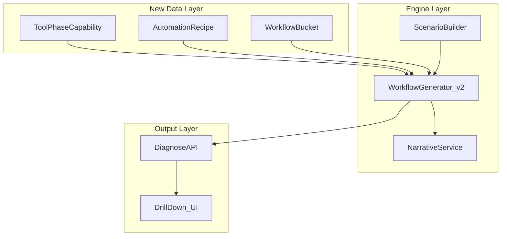

# Workflow Intelligence Engine - Implementation Plan

## Overview

Evolve the workflow generation system from hardcoded, tool-agnostic role strings to a data-driven, tool-specific recommendation engine with 7 phases, automation recipes, multi-tool phase assignments, and a drill-down sub-phase UI.

## Architecture Overview

The current workflow generator (`scenarioBuilder.buildWorkflow()`) produces 5 generic rows with hardcoded text that ignores which tool was selected. This plan introduces a **structured knowledge layer** (tool capabilities + automation recipes) that powers tool-specific, automation-aware workflow output with sub-phase drill-down.



## Key Design Decisions

- **7 phases** replace the current 5: DISCOVER, DECIDE, DESIGN, BUILD, LAUNCH, REVIEW, ITERATE
- **Buckets** (sub-phases) are the drill-down layer within each phase, driven by `WorkflowBucket` data
- **Multiple tools per phase** -- each with a distinct role from `ToolPhaseCapability`
- **Automation recipes** are pairwise (trigger tool -> action tool) and composed into chains at query time
- **Backward compatibility**: `WorkflowStep.phase` is already `string`, so the frontend renders any phase name without breaking. The enriched response extends the type additively
- The **existing `PhaseRecommendationService`** is repurposed (not deleted) to query the new data

---

## Phase 1: Data Model Changes

**File: `lib/prisma/schema.prisma`**

### 1a. Expand WorkflowPhase enum (5 -> 7)

Replace the current enum:

```prisma
enum WorkflowPhase {
  DISCOVER    // was IDEATION
  DECIDE      // new
  DESIGN      // was part of PLANNING
  BUILD       // was EXECUTION
  LAUNCH      // new
  REVIEW
  ITERATE
}
```

### 1b. Add new enums

```prisma
enum ConnectorType {
  NATIVE
  GITHUB_ACTIONS
  ZAPIER
  MAKE
  WEBHOOK
  MCP
  API
  SLACK_WORKFLOW
}

enum AutomationLevel {
  FULL        // runs without human input
  SEMI        // human triggers, AI executes
  MANUAL      // human does it, AI assists
}

enum SetupDifficulty {
  TRIVIAL     // toggle a setting
  EASY        // follow a guide, < 30 min
  MEDIUM      // custom config, 1-2 hours
  HARD        // developer work, half a day+
}
```

### 1c. New model: WorkflowBucket (sub-phases)

```prisma
model WorkflowBucket {
  id            String        @id @default(cuid())
  phase         WorkflowPhase
  name          String        // e.g. "Problem Discovery"
  slug          String        @unique
  description   String
  displayOrder  Int           @default(0)
  
  inputs        String[]      // what feeds into this bucket
  outputs       String[]      // artifacts produced
  
  capabilities  ToolPhaseCapability[]
  
  @@index([phase])
}
```

### 1d. New model: ToolPhaseCapability

This is the core knowledge model -- what a specific tool can do in a specific sub-phase:

```prisma
model ToolPhaseCapability {
  id              String          @id @default(cuid())
  toolId          String
  bucketId        String
  
  featureName     String          // e.g. "Linear Asks (AI)"
  aiAction        String          // what the tool's AI does here
  humanAction     String          // what the human does
  artifact        String          // concrete output, e.g. "Ready-to-Code Issues"
  automationLevel AutomationLevel
  
  philosophyFit   String[]        // ["Auto-Pilot", "Hybrid"] -- which philosophies this applies to
  techSavviness   TechSavviness[] // who can use this
  
  displayOrder    Int             @default(0)
  
  tool            Tool            @relation(fields: [toolId], references: [id], onDelete: Cascade)
  bucket          WorkflowBucket  @relation(fields: [bucketId], references: [id], onDelete: Cascade)
  
  @@index([toolId])
  @@index([bucketId])
}
```

### 1e. New model: AutomationRecipe

Pairwise cross-tool automation patterns:

```prisma
model AutomationRecipe {
  id                  String          @id @default(cuid())
  name                String          // "Commit-Driven Status Updates"
  description         String          // human-readable explanation
  
  triggerToolId       String
  triggerEvent        String          // "commit_push", "emoji_reaction", "pr_merge"
  triggerDetail       String          // specific trigger description
  
  actionToolId        String
  actionType          String          // "create_issue", "update_status", "post_message"
  actionDetail        String          // specific action description
  
  connectorType       ConnectorType
  connectorDetail     String?         // setup specifics
  
  phases              WorkflowPhase[] // which phases this applies to
  philosophyFit       String[]        // ["Auto-Pilot", "Hybrid"]
  setupDifficulty     SetupDifficulty
  techSavviness       TechSavviness   // minimum required
  
  timeSavedPerWeek    String?         // "2-3 hours"
  humanBehaviorChange String?         // "Developers never open Linear manually"
  
  triggerTool         Tool            @relation("RecipeTrigger", fields: [triggerToolId], references: [id])
  actionTool          Tool            @relation("RecipeAction", fields: [actionToolId], references: [id])
  
  @@index([triggerToolId])
  @@index([actionToolId])
}
```

### 1f. Update Tool model

Add reverse relations to Tool:

```prisma
// Add to existing Tool model relations:
  phaseCapabilities    ToolPhaseCapability[]
  recipesAsTrigger     AutomationRecipe[]  @relation("RecipeTrigger")
  recipesAsAction      AutomationRecipe[]  @relation("RecipeAction")
```

### 1g. Run migration

```bash
npm run db:migrate -- --name add_workflow_intelligence
npm run db:generate
```

---

## Phase 2: Seed Data -- Knowledge Base

**File: `lib/scripts/seedData.ts`**  
**New file: `lib/scripts/seedWorkflowData.ts`** (separate file for workflow knowledge to keep seedData manageable)

### 2a. WorkflowBucket definitions (7 phases x 2-3 buckets each)

| Phase    | Buckets                                           |
| -------- | ------------------------------------------------- |
| DISCOVER | Problem Discovery, Market Research, Bug Triage    |
| DECIDE   | Prioritization, Strategy Alignment                |
| DESIGN   | Solution Discovery, Prototyping, Spec Writing     |
| BUILD    | Delivery Planning, Execution, Code Review/QA    |
| LAUNCH   | Release, Announcement, Instrumentation            |
| REVIEW   | Feedback Collection, Retrospective                 |
| ITERATE  | Metrics Analysis, Documentation, Backlog Grooming  |

### 2b. ToolPhaseCapability records for top ~30 tools

Priority tools (ones the engine recommends most):

- **Notion**: capabilities in DISCOVER (research aggregation), DESIGN (PRD drafting), ITERATE (changelog)
- **Linear**: capabilities in DECIDE (prioritization), BUILD (sprint management), BUILD (auto-triage)
- **Cursor**: capabilities in BUILD (code generation, Composer), BUILD (code review assist)
- **GitHub**: capabilities in BUILD (PR workflow, Actions), LAUNCH (deployment trigger)
- **Slack**: capabilities in DISCOVER (feedback routing), REVIEW (async standup)
- **Figma**: capabilities in DESIGN (prototyping, AI layout)
- **PostHog**: capabilities in LAUNCH (instrumentation), ITERATE (metrics)
- ...and ~22 more high-frequency tools

Each record uses specific feature names (e.g. "Linear Asks (AI)", "Cursor Composer", "Notion AI Summarize") drawn from the tool's actual `aiFeatureDescription` and `keyFeatures`.

### 2c. AutomationRecipe records (~50-80 recipes)

Priority recipes for common tool pairs:

- **Slack emoji -> Linear ticket** (ConnectorType: NATIVE or ZAPIER)
- **GitHub commit -> Linear status update** (NATIVE)
- **PR merge -> Vercel deploy preview** (NATIVE)
- **Linear cycle complete -> Notion changelog** (ZAPIER/MAKE)
- **Notion spec approval -> Linear issue creation** (LINEAR_ASKS or ZAPIER)
- **Meeting transcript (Fireflies) -> Notion summary** (ZAPIER)
- **PostHog anomaly alert -> Slack notification** (NATIVE)
- **GitHub PR open -> Slack review request** (GITHUB_ACTIONS)
- **MCP: Cursor reads Linear issues for context** (MCP)
- **MCP: Claude reads Notion docs for research** (MCP)
- ...and more

### 2d. Seed script update

**File: `lib/scripts/seed.ts`** -- add seeding logic for new tables

---

## Phase 3: New Workflow Services

### 3a. New file: `lib/services/workflowIntelligenceService.ts`

Central service that assembles rich workflow output from the new data:

```typescript
class WorkflowIntelligenceService {
  // Given a set of tools + user context, build the full workflow
  async buildIntelligentWorkflow(
    tools: Tool[],
    philosophy: string,
    techSavviness: TechSavviness
  ): Promise<IntelligentWorkflow>
  
  // For each phase, find matching ToolPhaseCapabilities for the assigned tools
  async getCapabilitiesForPhase(
    toolIds: string[],
    phase: WorkflowPhase,
    philosophy: string
  ): Promise<ToolPhaseCapability[]>
  
  // Find automation recipes between any pair of tools in the stack
  async findApplicableRecipes(
    toolIds: string[],
    philosophy: string,
    techSavviness: TechSavviness
  ): Promise<AutomationRecipe[]>
  
  // Compose pairwise recipes into chains (multi-step automations)
  composeChains(recipes: AutomationRecipe[]): AutomationChain[]
}
```

### 3b. Repurpose: `lib/services/phaseRecommendationService.ts`

Update to query `ToolPhaseCapability` via `WorkflowBucket` instead of the old `PhaseToolRecommendation` table. Migrate or deprecate the old table once new data is in place.

---

## Phase 4: Engine Rewire

### 4a. Update ScenarioBuilder (`lib/engine/scenarioBuilder.ts`)

**Change 1: Phase list from 5 to 7**

```typescript
// Replace:
const phases = ['Ideation', 'Planning', 'Execution', 'Review', 'Iterate'];

// With:
const phases = ['Discover', 'Decide', 'Design', 'Build', 'Launch', 'Review', 'Iterate'];
```

**Change 2: Update PHASE_CATEGORY_MAP for 7 phases**

```typescript
const PHASE_CATEGORY_MAP: Record<string, string[]> = {
  'Discover': ['DOCUMENTATION', 'AI_ASSISTANTS', 'COMMUNICATION', 'GROWTH'],
  'Decide':   ['PROJECT_MANAGEMENT', 'DOCUMENTATION', 'AI_ASSISTANTS'],
  'Design':   ['DOCUMENTATION', 'DESIGN', 'AI_ASSISTANTS', 'AI_BUILDERS'],
  'Build':    ['DEVELOPMENT', 'AI_BUILDERS', 'AI_ASSISTANTS', 'PROJECT_MANAGEMENT'],
  'Launch':   ['DEVELOPMENT', 'AUTOMATION', 'COMMUNICATION', 'ANALYTICS'],
  'Review':   ['MEETINGS', 'COMMUNICATION', 'ANALYTICS'],
  'Iterate':  ['ANALYTICS', 'GROWTH', 'PROJECT_MANAGEMENT', 'DOCUMENTATION'],
};
```

**Change 3: Multi-tool per phase**

Replace `findToolForPhase` (returns one tool) with logic that returns 2-3 tools per phase with distinct roles. The primary tool covers the main activity; secondary tools handle supporting activities (e.g., Build gets Cursor for coding + GitHub for version control + Linear for status tracking).

**Change 4: Wire to WorkflowIntelligenceService**

Replace the inline `buildWorkflow()` method with a call to `workflowIntelligenceService.buildIntelligentWorkflow()`, which returns the enriched workflow with sub-steps and automation recipes.

### 4b. Update WorkflowGenerator (`lib/engine/workflowGenerator.ts`)

Remove all hardcoded role strings (the ~90-line `getRolesForPhase` method). Replace with `ToolPhaseCapability` lookups. If no capability data exists for a tool+phase combination, fall back to a category-based default or generate via Claude.

Remove the hardcoded `findIntegrations` method (line 219-237) which has the TODO comment "In a real implementation, this would query the integrations table." Replace with actual `ToolIntegration` + `AutomationRecipe` queries.

### 4c. Update NarrativeService (`lib/engine/narrativeService.ts`)

Enrich the Claude prompt with:

- Specific tool capabilities per phase (from ToolPhaseCapability data)
- Applicable automation recipes between the scenario's tools
- This lets Claude generate narratives that reference real features and automations

---

## Phase 5: Types and API Update

### 5a. Extend WorkflowStep (`types.ts`)

```typescript
// Enriched workflow step (backward compatible -- new fields are optional)
export interface WorkflowStep {
  phase: string;
  tool: string;
  aiAgentRole: string;
  humanRole: string;
  outcome: string;
  
  // New fields for drill-down
  subSteps?: WorkflowSubStep[];
  automations?: WorkflowAutomation[];
  secondaryTools?: { tool: string; role: string }[];
}

export interface WorkflowSubStep {
  bucket: string;          // "Code Review/QA"
  tool: string;            // "GitHub"
  featureName: string;     // "Copilot Code Review"
  aiAction: string;        // "Generates review summary, flags issues"
  humanAction: string;     // "Reviews diffs, approves merge"
  artifact: string;        // "Approved PR"
  automationLevel: string; // "SEMI"
}

export interface WorkflowAutomation {
  name: string;            // "Commit-Driven Status Updates"
  triggerTool: string;     // "GitHub"
  triggerEvent: string;    // "commit_push"
  actionTool: string;      // "Linear"
  actionResult: string;    // "Issue moves to In Review"
  connectorType: string;   // "NATIVE"
  setupDifficulty: string; // "EASY"
  timeSaved: string;       // "2-3 hrs/week"
}
```

### 5b. Update API response (`api/diagnose.ts`)

The `DiagnosisResponse` workflow type gains the new optional fields. The response is additively extended -- old clients that don't read `subSteps` or `automations` still work fine.

### 5c. Update Gemini fallback (`services/geminiService.ts`)

Update the `workflowStepSchema` to include the new optional fields so the Gemini fallback can also produce sub-steps (though with lower quality than the data-driven backend).

---

## Phase 6: Frontend Drill-Down UI

### 6a. Update DiagnosisReport (`components/DiagnosisReport.tsx`)

**Change 1: Expandable phase rows**

Each workflow row becomes clickable. Clicking expands to show:

- Sub-step table (bucket-level detail)
- Automation recipe cards
- Secondary tool assignments

**Change 2: Sub-step detail view**

Inside the expanded row, render a nested table:

```
| Sub-process      | Tool   | AI Action                          | Human Action              | Artifact         |
|------------------|--------|------------------------------------|---------------------------|------------------|
| Code Review / QA | GitHub | Copilot generates review summary   | Reviews diffs, approves   | Approved PR      |
| Sprint Tracking  | Linear | Auto-updates status from commits   | Adjusts capacity          | Updated Board    |
```

**Change 3: Automation recipe badges**

Show small cards between phase rows where cross-phase automations connect:

```
[GitHub] --commit--> [Linear auto-status] (Native, Easy setup, saves ~2hrs/wk)
```

**Change 4: Phase count update**

The tab header and table now render 7 phases instead of 5. The table gains ~2 more rows at the summary level but the drill-down is where the real depth lives.

---

## Migration Strategy for Existing Data

- The old `PhaseToolRecommendation` table stays until new data is fully populated, then is deprecated
- Old `WorkflowPhase` enum values (IDEATION, PLANNING, EXECUTION) need a migration mapping:
  - IDEATION -> DISCOVER
  - PLANNING -> split into DECIDE + DESIGN
  - EXECUTION -> BUILD
  - REVIEW -> stays REVIEW
  - ITERATE -> stays ITERATE
- Add LAUNCH as net new
- Run as a two-step migration: add new values first, then update existing records, then remove old values

---

## Files Changed Summary

| File                                          | Change Type                                                |
| --------------------------------------------- | ---------------------------------------------------------- |
| `lib/prisma/schema.prisma`                    | Major -- new models, expanded enum, new relations          |
| `lib/scripts/seedWorkflowData.ts`             | **New** -- workflow knowledge base seed data               |
| `lib/scripts/seed.ts`                         | Minor -- import and call new seed                          |
| `lib/services/workflowIntelligenceService.ts` | **New** -- central workflow assembly service              |
| `lib/services/phaseRecommendationService.ts`  | Refactor -- query new models                               |
| `lib/engine/scenarioBuilder.ts`               | Major -- 7 phases, multi-tool, wire to new service        |
| `lib/engine/workflowGenerator.ts`             | Major -- remove hardcoded roles, use capability data       |
| `lib/engine/narrativeService.ts`              | Minor -- enrich prompt with capabilities and recipes       |
| `types.ts`                                    | Additive -- new sub-step and automation types              |
| `api/diagnose.ts`                             | Minor -- pass through enriched workflow                    |
| `services/geminiService.ts`                   | Minor -- update schema                                     |
| `components/DiagnosisReport.tsx`              | Major -- expandable rows, sub-step table, automation cards |
| `CLAUDE.md`                                   | Minor -- update architecture docs                          |

---

## Implementation Checklist

- [ ] **Phase 1**: Add new Prisma models (WorkflowBucket, ToolPhaseCapability, AutomationRecipe), expand WorkflowPhase to 7 values, add new enums (ConnectorType, AutomationLevel, SetupDifficulty), update Tool relations, run migration
- [ ] **Phase 2**: Create seedWorkflowData.ts with bucket definitions (7 phases x 2-3 buckets), ToolPhaseCapability records for top ~30 tools, and ~50-80 AutomationRecipe records for common tool pairs. Update seed.ts to call it
- [ ] **Phase 3**: Build WorkflowIntelligenceService (assembles enriched workflow from capabilities + recipes), repurpose PhaseRecommendationService to query new models
- [ ] **Phase 4**: Update ScenarioBuilder (7 phases, multi-tool assignment, wire to intelligence service), rewrite WorkflowGenerator (remove hardcoded roles, use ToolPhaseCapability data), enrich NarrativeService prompt with capability and recipe data
- [ ] **Phase 5**: Extend WorkflowStep type with subSteps, automations, secondaryTools (backward compatible). Update diagnose API response and Gemini fallback schema
- [ ] **Phase 6**: Build expandable phase rows in DiagnosisReport with sub-step detail table, automation recipe cards, and secondary tool badges
